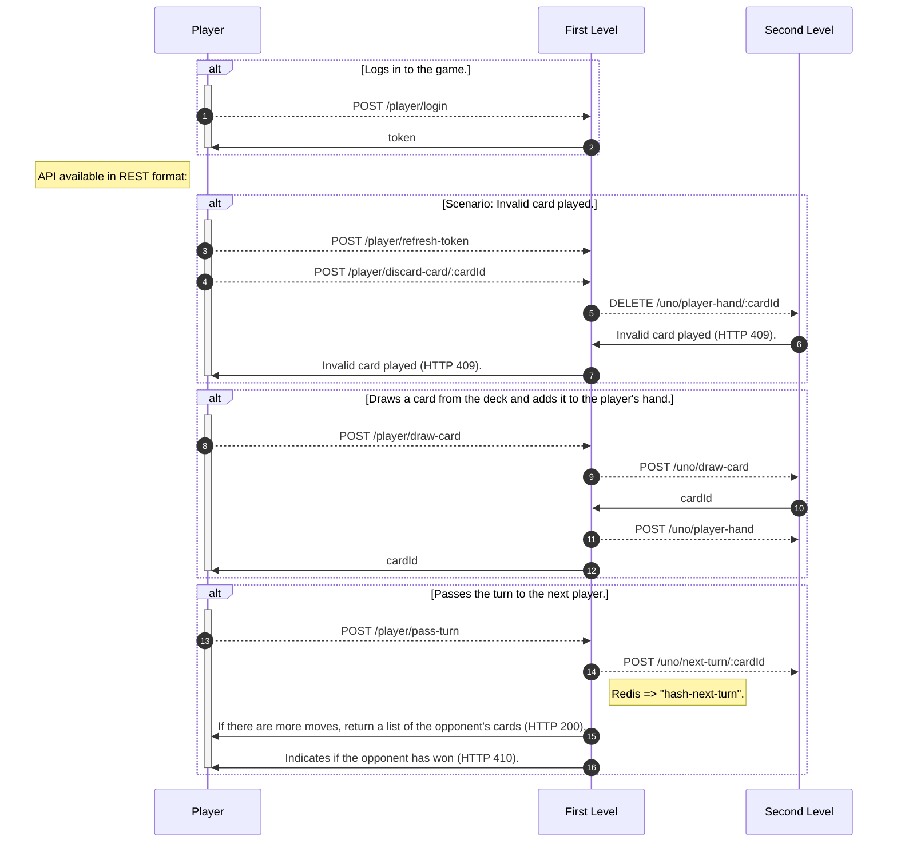

# [Uno](https://en.wikipedia.org/wiki/Uno_(card_game))

_This project was developed as part of the final work of the Postgraduate course at [PUCPR](https://www.pucpr.br). Inspired by the original idea of ​​[Space Invaders](https://jay-ithiel.github.io/space_invaders) developed by the AWS team, the objective is to create an online version of the game [**Uno** ](https://en.wikipedia.org/wiki/Uno_(card_game)), with a special focus on minimizing costs and avoiding **Cloud Vendor lock-in**._

## Usage

## Architecture

The architecture is based on Serverless using [**Clojure**](https://clojure.org), with external communication through a REST API, and internal communication, depending on the platform, is triggered via HTTP Trigger (in this case from [Azure Functions](https://azure.microsoft.com/en-us/products/functions)) or API Gateway (when using [AWS Lambda](https://aws.amazon.com/pt/pm/lambda)).

Microservices are organized into two main levels:

- First level (Interface and Orchestration):
This level acts as a direct interface for user requests. Your responsibility is to orchestrate calls to second-level services, integrating and composing responses.
- Second level (Application State Management):
The second level is responsible for managing and updating the state of the application. It encapsulates core logic and performs operations that change the state of the system.

  

