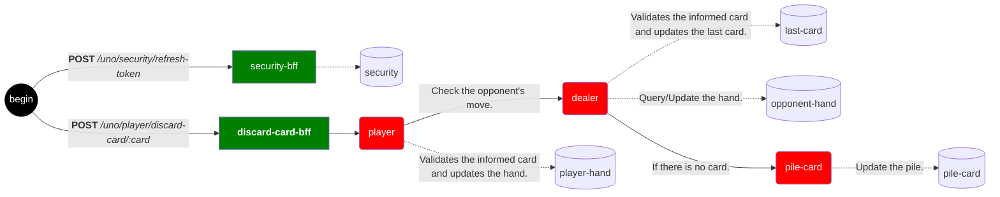
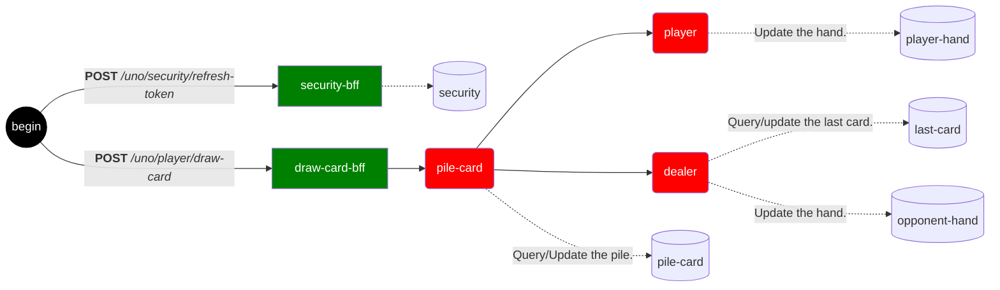
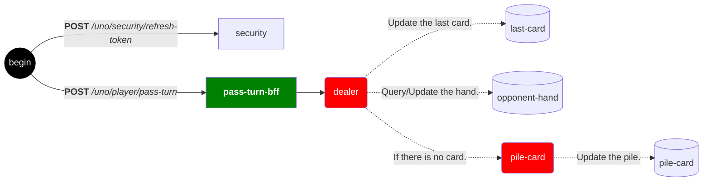

# [Uno](https://en.wikipedia.org/wiki/Uno_(card_game))

_**This project was developed for the Postgraduate course at [PUCPR](https://www.pucpr.br)**. Inspired by the original idea of ​​[Space Invaders](https://jay-ithiel.github.io/space_invaders) developed by the AWS team, the objective is to create an online version of the game [**Uno**](https://en.wikipedia.org/wiki/Uno_(card_game)), with a special focus on minimizing costs and avoiding **Cloud Vendor lock-In**._

## Usage

## Architecture

The architecture is based on a **serverless model** using [**Clojure**](https://clojure.org), with external communication handled via a `REST API`. Internal communication varies depending on the platform: it uses `HTTP Triggers` in the case of [Azure Functions](https://azure.microsoft.com/en-us/products/functions) or `API Gateway` when using [AWS Lambda](https://aws.amazon.com/lambda).

**Microservices are organized into two main levels**:

- **Back-end for Front-end (BFF)**:
This level acts as a direct interface for user requests. Your responsibility is to orchestrate calls to second-level services, integrating and composing responses.
- **Second level (Application State Management)**:
The second level is responsible for managing the application state and encapsulating the core logic.

### Services Available

<details>
  <summary><code>POST</code> <code><b>/uno/player/discard-card/:card</b></code> <i>(discard the player's card)</i></summary>


</details>

<details>
  <summary><code>POST</code> <code><b>/uno/player/draw-card</b></code> <i>(deal and draw cards from the pile)</i></summary>

#### Parameters

> | Name          |  Type  | Description       |
> |---------------|--------|-------------------|
> | Authorization | Header | *Security token.* |

#### Responses

> | HTTP Code | Description                                 |
> |-----------|---------------------------------------------|
> | `200`     | *Returns the player's cards and last card.* |
> | `401`     | *Invalid authentication.*                   |
> | `409`     | *Invalid play.*                             |



#### Example cURL

> ```javascript
>  curl --request POST '{{uno}}/uno/player/draw-card' \
>  --header 'Authorization: {{authorization}}'
> ```

</details>

<details>
  <summary><code>POST</code> <code><b>/uno/player/pass-turn</b></code> <i>(pass the turn to the opponent)</i></summary>


</details>
