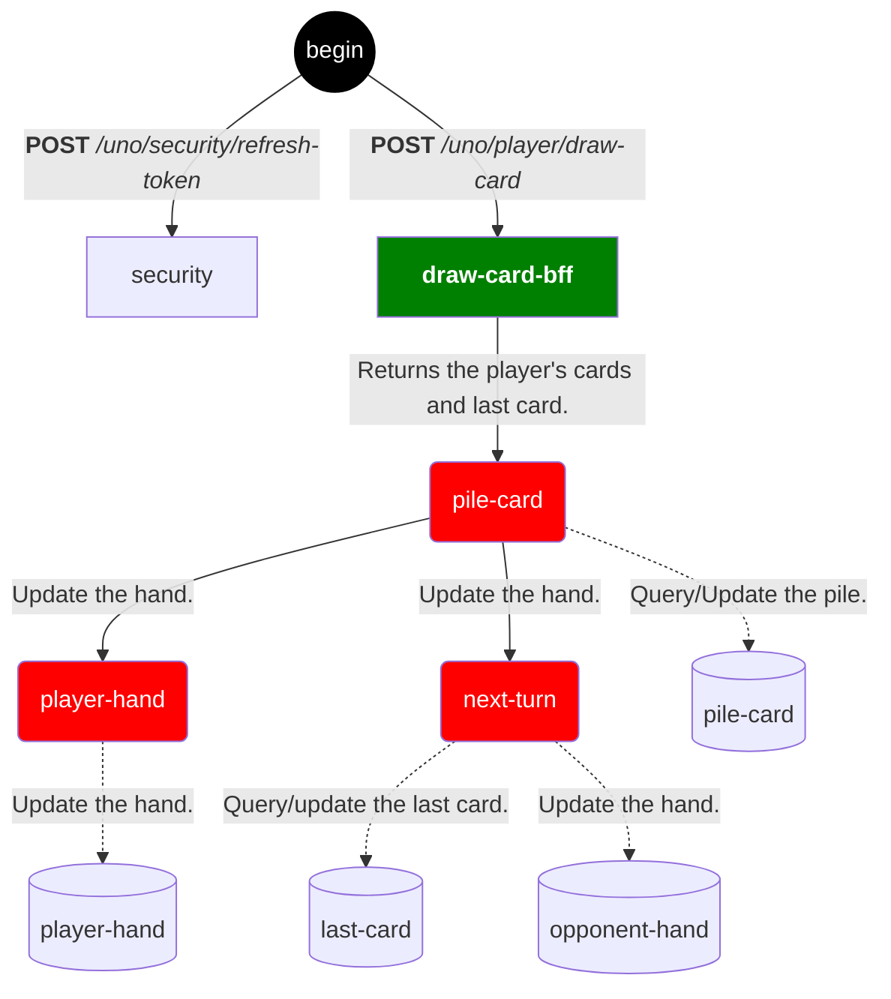
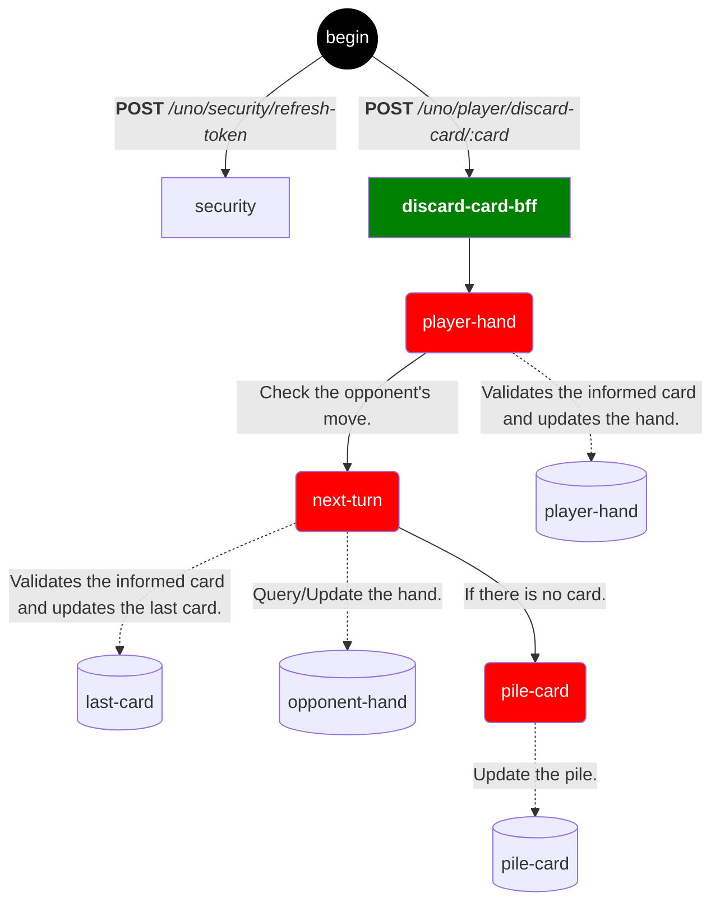
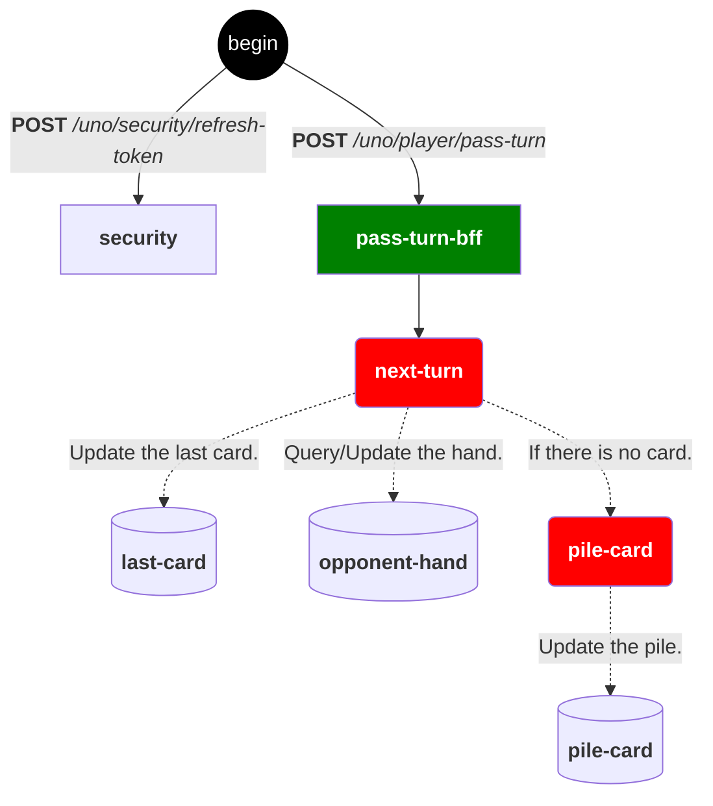

# [Uno](https://en.wikipedia.org/wiki/Uno_(card_game))

_**This project was developed for the Postgraduate course at [PUCPR](https://www.pucpr.br)**. Inspired by the original idea of ​​[Space Invaders](https://jay-ithiel.github.io/space_invaders) developed by the AWS team, the objective is to create an online version of the game [**Uno** ](https://en.wikipedia.org/wiki/Uno_(card_game)), with a special focus on minimizing costs and avoiding **Cloud Vendor lock-in**._

## Usage

## Architecture

A arquitetura é baseada em um modelo serverless usando [**Clojure**](https://clojure.org), com comunicação externa feita por meio de uma API REST. A comunicação interna varia dependendo da plataforma: usa HTTP Triggers no caso do [Azure Functions](https://azure.microsoft.com/en-us/products/functions), ou API Gateway ao utilizar [AWS Lambda](https://aws.amazon.com/pt/pm/lambda).

**Microservices are organized into two main levels**:

- **Back-end for Front-end (BFF)**:
_This level acts as a direct interface for user requests. Your responsibility is to orchestrate calls to second-level services, integrating and composing responses._
- **Second level (Application State Management)**:
_The second level is responsible for managing the application state and encapsulating the core logic._

### Services Available

  
<b>Deliver cards and draw from the pile.</b> <i>(click to see)</i>

  
<b>Discard the player's card.</b> <i>(click to see)</i>

  
<b>Pass the turn to the opponent.</b> <i>(click to see)</i>

**Applications:**
- **draw-card**: *Deal the cards and draw from the pile.*
- **next-turn**: *Validates the discarded card if any and returns the opponent's card.*
- **refresh-token**: *Generates the security token.*
