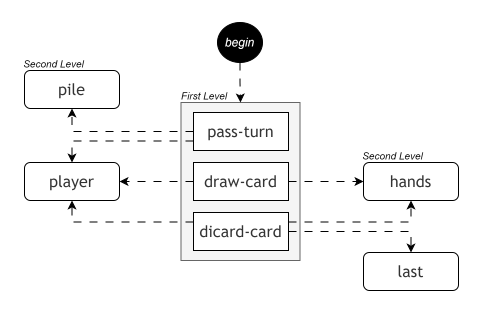
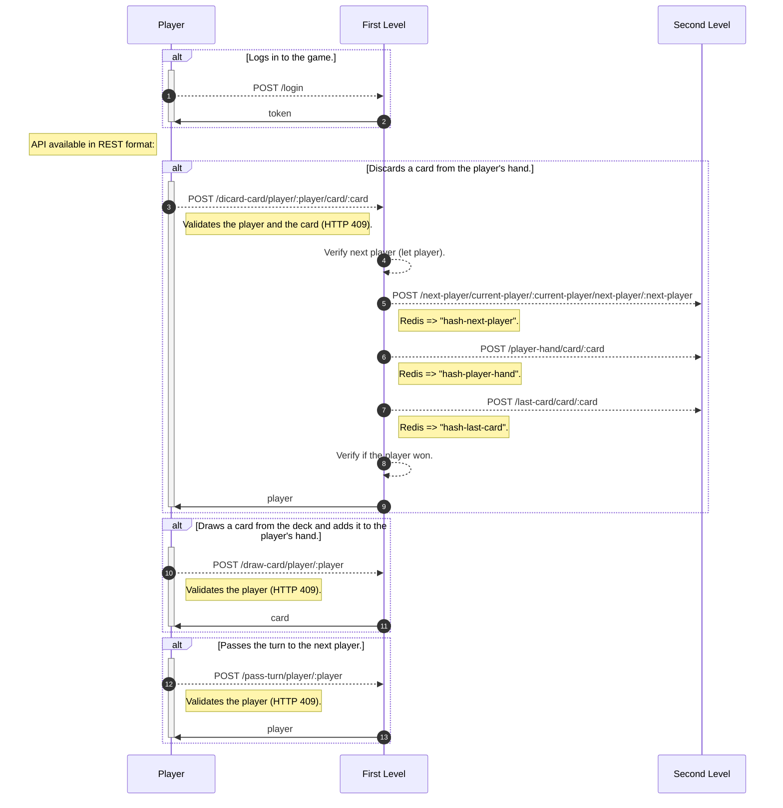

# [Uno](https://en.wikipedia.org/wiki/Uno_(card_game))

_This project was developed as part of the final course work for [PUCPR](https://www.pucpr.br). Inspired by the original [Space Invaders](https://jay-ithiel.github.io/space_invaders) idea built by the AWS team, the goal was to create an online version of the [**Uno**](https://en.wikipedia.org/wiki/Uno_(card_game)) game, with a special focus on minimizing costs and avoiding **Cloud Vendor Lock-In**._

## ⚡️Run the project

## 👨‍🎓 A little about the architecture

The architecture is based on Serverless, using [**Clojure**](https://clojure.org) for function development, with communication happening through HTTP calls. Depending on the platform, these functions are triggered via HTTP Trigger (in the case of [Azure Functions](https://azure.microsoft.com/en-us/products/functions)) or API Gateway (when using [AWS Lambda](https://aws.amazon.com/pt/pm/lambda)).

The architecture is organized into two main levels:

- First level (Interface and Orchestration):
This level acts as the direct interface with user requests. Its responsibility is to orchestrate calls to services in the second level, integrating and composing the responses. It serves as the application’s entry point, handling external HTTP requests and coordinating interactions between different services.
- Second level (Application State Management):
The second level is responsible for managing and updating the application state. It encapsulates the core business logic and performs operations that alter the system's state, such as data manipulation. Functions in this level are designed to be self-sufficient and independent, being triggered by the first level as needed.

